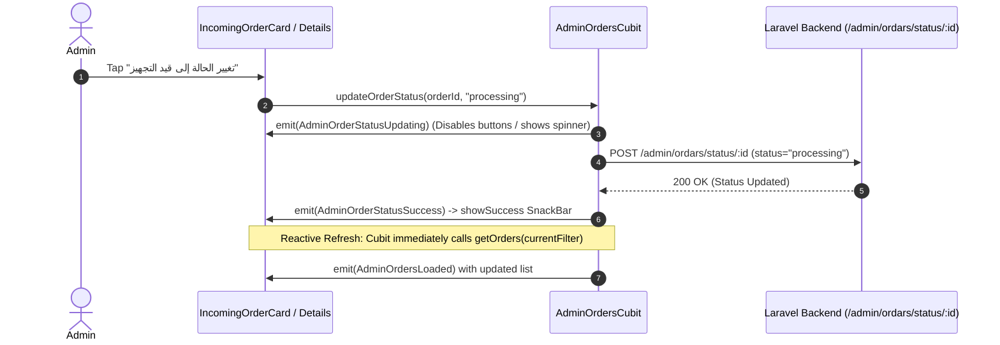

# Implementation Plan — Module 7: Admin Orders & Suggestions Management (Tasks 7.1 & 7.2)

## Goal Description
Build the complete Clean Architecture layers (Data, Domain, and Presentation) for **Admin Orders Management** and **Admin Suggestions Review**, connecting the existing UI screens (`AdminOrdersScreen`, `AdminOrderDetailsScreen`, `AdminSuggestionsScreen`) to live backend data while ensuring zero UI freeze, precise backend API path matching (including the Postman typo `/admin/ordars`), and instantaneous reactive state refresh when updating order statuses.

---

## User Review Required

> [!IMPORTANT]
> **API Path Typo Alignment**:
> Based on exact lines verified in `primo.postman_collection.json` (`Lines 4010, 4093, 4190`), the Admin Orders API endpoints use the typo **`ordars`**:
> - `GET /admin/ordars?status={status}` (status: `all`, `pending`, `processing`, `completed`)
> - `GET /admin/ordars/:ordar_id`
> - `POST /admin/ordars/status/:ordar_id` (FormData: `status`: `pending` | `processing` | `completed`)
> 
> Similarly, for Suggestions (`Line 3907` & Dashboard `GET /admin/home`):
> - `GET /admin/suggestions` (or fetching from `/admin/home` suggestions list + endpoint)
> - `POST /admin/suggestions/:suggestion_id/status` (FormData: `status`: `approved` | `rejected`)

---

## Architecture Breakdown & Endpoints

### 1. Task 7.1: Admin Orders Management

#### API Endpoints (`lib/core/network/api_constant.dart`)
```dart
static const String adminOrders = "/admin/ordars";
static const String adminOrderStatus = "/admin/ordars/status";
```

#### Clean Architecture Structure
1. **Domain Layer (`lib/feature/admin_orders/domain/`)**:
   - **Repository Interface (`admin_orders_repo.dart`)**:
     ```dart
     abstract class AdminOrdersRepo {
       Future<Either<Failure, List<OrderModel>>> getAdminOrders({String? status});
       Future<Either<Failure, OrderModel>> getAdminOrderDetails(int orderId);
       Future<Either<Failure, String>> updateOrderStatus(int orderId, String newStatus);
     }
     ```
   - **UseCases (`usecases/`)**:
     - `GetAdminOrdersUseCase`
     - `GetAdminOrderDetailsUseCase`
     - `UpdateOrderStatusUseCase`

2. **Data Layer (`lib/feature/admin_orders/data/`)**:
   - **Repository Implementation (`admin_orders_repo_impl.dart`)**:
     - Implements API calls using `ApiConsumer`.
     - Uses **`compute()`** Isolate parsing for large order lists to prevent UI thread drops.

3. **Presentation Layer (`lib/feature/admin_orders/presentation/`)**:
   - **State (`AdminOrdersState`)**:
     - `AdminOrdersInitial`, `AdminOrdersLoading`, `AdminOrdersLoaded(List<OrderModel> orders, String currentFilter)`, `AdminOrdersError(String message)`
     - `AdminOrderStatusUpdating(int orderId)`, `AdminOrderStatusSuccess(String message)`
   - **Cubit (`AdminOrdersCubit`)**:
     - `getOrders({String status = 'all'})`
     - `filterOrdersByStatus(String status)`
     - `updateOrderStatus(int orderId, String newStatus)`

#### UI Integration (`AdminOrdersScreen` & `AdminOrderDetailsScreen`)
- Replace mock data in `AdminOrdersScreen` with `BlocBuilder<AdminOrdersCubit, AdminOrdersState>`.
- Wire `OrdersTabBar` (`الكل`, `قيد الانتظار`, `قيد التجهيز`, `مكتمل`) to call `filterOrdersByStatus()`.
- Display orders using `IncomingOrderCard`, refactored to use `AppCachedNetworkImage` and provide action buttons to update order status.

---

### 2. Task 7.2: Admin Suggestions Review

#### Clean Architecture Structure
1. **Domain & Data Layers (`lib/feature/admin_suggestions/`)**:
   - **Repository Interface & Impl**:
     - `getSuggestions()` -> `GET /admin/suggestions` (or falls back cleanly to dashboard suggestions).
     - `updateSuggestionStatus(int id, String status)` -> `POST /admin/suggestions/:id/status`.
2. **Presentation Layer**:
   - **Cubit (`AdminSuggestionsCubit`)**:
     - Fetches suggestions list and emits `AdminSuggestionsLoaded`.
     - Allows admin to approve/review suggestions.
- Replace static list in `AdminSuggestionsScreen` with live `BlocBuilder`.

---

### 3. Reactive State Refresh Strategy

To ensure instantaneous UI feedback when an Admin updates an order's status (e.g. from `pending` -> `processing` or `processing` -> `completed`):



1. **Optimistic / Automatic Refresh**:
   - Upon successful status update (`Right(successMessage)`), `AdminOrdersCubit` emits `AdminOrderStatusSuccess(message)` (triggering a `showSuccess` SnackBar in `BlocConsumer.listener`).
   - Immediately following success, `AdminOrdersCubit` re-triggers `getOrders(status: currentFilter)` so the order list updates dynamically without requiring a manual page refresh.

---

## Verification Plan

### Automated Verification
- Run `flutter analyze` to ensure 0 compile/lint errors across the new Clean Architecture files.

### Manual / Execution Verification
- Test filtering Admin Orders across `all`, `pending`, `processing`, and `completed`.
- Verify updating order status calls `POST /admin/ordars/status/:id` and triggers automatic list refresh.
